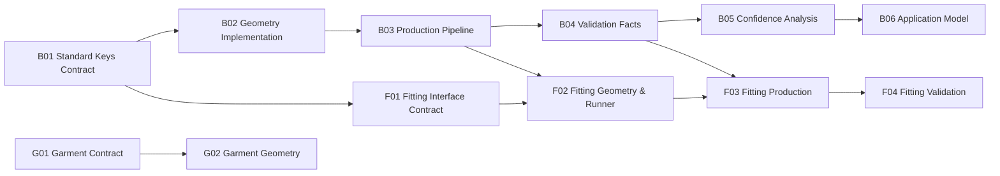

<!-- GENERATED — DO NOT EDIT MANUALLY -->
<!-- This file is rendered by tools/render_dashboard_v0.py -->
<!-- Manual edits will be overwritten on next render cycle. -->
<!-- To change plan/structure: edit docs/ops/dashboard/PLAN_v0.yaml -->
<!-- To change data sources: edit docs/ops/dashboard/LAB_SOURCES_v0.yaml -->

# Project Dashboard

**Milestone**: M01_baseline
**Rendered**: 2026-01-30T13:19:45Z

---

## Data Sources

| Source | Path | Status |
|--------|------|--------|
| Plan (SSoT) | `docs/ops/dashboard/PLAN_v0.yaml` | loaded |
| Lab Sources | `docs/ops/dashboard/LAB_SOURCES_v0.yaml` | loaded |
| Export Contract | `docs/ops/dashboard/EXPORT_CONTRACT_v0.md` | reference |
| hub (body) log | `C:/Users/caino/Desktop/AI_model/exports/progress/PROGRESS_LOG.jsonl` | loaded |
| fitting_lab (fitting) log | `C:/Users/caino/Desktop/fitting_lab/exports/progress/PROGRESS_LOG.jsonl` | loaded |
| garment_lab (garment) log | `C:/Users/caino/Desktop/garment_lab/exports/progress/PROGRESS_LOG.jsonl` | loaded |

---

## Phase x Module Matrix

| Phase | Body | Fitting | Garment |
|-------|------|---------|---------|
| **P01** Contract & Data Foundation | B01: 3/3 | F01: 0/3 | G01: 0/2 |
| **P02** Geometry & Measurement | B02: 1/3 B03: 0/3 | F02: 0/2 | G02: 0/2 |
| **P03** Validation & Confidence | B04: 0/3 B05: 0/2 | F03: 0/2 F04: 0/2 | — |
| **P04** Application | B06: 0/2 | — | — |

> Cell format: `<step_id>: <done>/<total>`

---

## Module Progress

### Body

| Step | Name | Layer | Done | Total | Progress | Unlocks |
|------|------|-------|------|-------|----------|---------|
| B01 | Standard Keys Contract | L1 | 3 | 3 | 100% | body:B02, fitting:F01 |
| B02 | Geometry Implementation | L2 | 1 | 3 | 33% | body:B03 |
| B03 | Production Pipeline | L3 | 0 | 3 | 0% | body:B04, fitting:F02 |
| B04 | Validation Facts | L4 | 0 | 3 | 0% | body:B05, fitting:F03 |
| B05 | Confidence Analysis | L5 | 0 | 2 | 0% | body:B06 |
| B06 | Application Model | L6 | 0 | 2 | 0% | — |
| **Total** | | | **4** | **16** | **25%** | |

### Fitting

| Step | Name | Layer | Done | Total | Progress | Unlocks |
|------|------|-------|------|-------|----------|---------|
| F01 | Fitting Interface Contract | L1 | 0 | 3 | 0% | fitting:F02 |
| F02 | Fitting Geometry & Runner | L2 | 0 | 2 | 0% | fitting:F03 |
| F03 | Fitting Production | L3 | 0 | 2 | 0% | fitting:F04 |
| F04 | Fitting Validation | L4 | 0 | 2 | 0% | — |
| **Total** | | | **0** | **9** | **0%** | |

### Garment

| Step | Name | Layer | Done | Total | Progress | Unlocks |
|------|------|-------|------|-------|----------|---------|
| G01 | Garment Contract | L1 | 0 | 2 | 0% | garment:G02 |
| G02 | Garment Geometry | L2 | 0 | 2 | 0% | — |
| **Total** | | | **0** | **4** | **0%** | |

---

## Unlock Status

| Step | Depends On | Unlock Status |
|------|------------|---------------|
| B01 | (none) | UNLOCKED |
| B02 | body:B01 | UNLOCKED |
| B03 | body:B02 | BLOCKED |
| B04 | body:B03 | BLOCKED |
| B05 | body:B04 | BLOCKED |
| B06 | body:B05 | BLOCKED |
| F01 | body:B01 | UNLOCKED |
| F02 | fitting:F01, body:B03 | BLOCKED |
| F03 | fitting:F02, body:B04 | BLOCKED |
| F04 | fitting:F03 | BLOCKED |
| G01 | (none) | UNLOCKED |
| G02 | garment:G01 | BLOCKED |

> UNLOCKED = all dependencies have done == total. BLOCKED = at least one dependency incomplete.

---

## Available Work (UNLOCKED, remaining > 0)

| Step | Module | Name | Done | Total | Remaining | Unlocks |
|------|--------|------|------|-------|-----------|---------|
| B02 | body | Geometry Implementation | 1 | 3 | 2 | body:B03 |
| F01 | fitting | Fitting Interface Contract | 0 | 3 | 3 | fitting:F02 |
| G01 | garment | Garment Contract | 0 | 2 | 2 | garment:G02 |

> Available = UNLOCKED and done < total

---

## Next Unlock Targets (BLOCKED with exactly 1 incomplete dependency)

| Step | Module | Name | Blocking Dependency | Blocking Done/Total |
|------|--------|------|---------------------|---------------------|
| B03 | body | Production Pipeline | B02 | 1/3 |
| B04 | body | Validation Facts | B03 | 0/3 |
| B05 | body | Confidence Analysis | B04 | 0/3 |
| B06 | body | Application Model | B05 | 0/2 |
| F04 | fitting | Fitting Validation | F03 | 0/2 |
| G02 | garment | Garment Geometry | G01 | 0/2 |

> Next unlock = BLOCKED with exactly 1 incomplete dependency

---

## Recent Events

| # | Timestamp | Lab | Module | Step | Delta | Evidence Count | Evidence Sample | Note |
|---|-----------|-----|--------|------|-------|----------------|-----------------|------|
| 1 | 2026-01-29T18:46:20.111017+09:00 | hub | body | B02 | 1 | 1 | specs/common/geometry_manifest.schema.json | geometry schema defined |
| 2 | 2026-01-29T18:46:11.140769+09:00 | hub | body | B01 | 1 | 1 | contract/sizekorea_v2.json | contract JSON |
| 3 | 2026-01-29T18:45:57.808415+09:00 | hub | body | B01 | 2 | 2 | docs/contract/standard_keys.md | standard keys + unit standard documented |

> Maximum 20 most recent events displayed. Full history in each lab's PROGRESS_LOG.jsonl.

---

## Dependency Graph (Mermaid, optional viewer support)

> Text tables above are the primary view. Mermaid is supplementary only.
